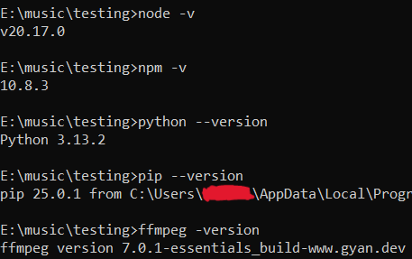
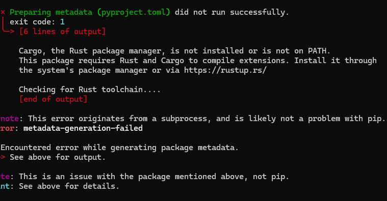
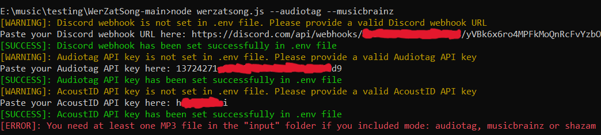

# WerZatSong

WerZatSong is a tool that helps you figure out song names from audio files. It provides different search modes to find matches: **Audfprint, Audiotag, MusicBrainz (AcoustID) and Shazam**. You can run a single mode or combine multiple modes. If multiple modes are selected, they will execute in the following order of priority:

1. **MusicBrainz** (AcoustID)
2. **Audiotag**
3. **Shazam**
4. **Audfprint**

This document will guide you step-by-step to install, set up, and use WerZatSong in a simple way.

## Requirements and Installation

Before you start, make sure these programs are installed on your computer:

### System Requirements

- [**Node.js**](https://nodejs.org) (v20.0 or higher) → Add to PATH and check in your terminal with `node -v` and `npm -v`
- [**Python**](https://www.python.org/downloads) (v3.13 or higher) → Add to PATH and check in your terminal with `python --version` and `pip --version`
- [**FFmpeg**](https://www.gyan.dev/ffmpeg/builds) → Add to PATH and check in your terminal with `ffmpeg -version`

  

### Program Requirements

To use WerZatSong effectively, you'll also need the following:

- **Discord Webhook URL** → For receiving match notifications (see *"How to Get a Discord Webhook URL"* below)
- **Audiotag API key** → Required for Audiotag search mode (see *"How to Get an Audiotag API Key"* below)
- **AcoustID API key** → Required for MusicBrainz/AcoustID search mode (see *"How to Get an AcoustID API Key"* below)
- **Database for Audfprint** → Required for Audfprint search mode (see *"Download the Audfprint Database"* below)
  - **Storage Alert** → The database is approximately **35GB**. If possible, use an **SSD** for faster performance over an **HDD**

#### How to Get a Discord Webhook URL

1. Open Discord and create your own server (if you don't have one)
2. In the **#general** text channel, click the gear icon (**Edit Channel**)
3. Go to **Integrations** → **Webhooks**
4. Click **Create Webhook**, then open it and select **Copy Webhook URL**
5. Save it for now, you'll need it soon

#### How to Get an Audiotag API Key

1. Go to the [Audiotag](https://audiotag.info) website
2. Create a new account or log in if you already have one
3. Go to the [**User Section**](https://user.audiotag.info) and click the **API keys** tab
4. Click **Create new API key** button, copy the key and save it for now

#### How to Get an AcoustID API Key

1. Go to the [AcoustID](https://acoustid.org) website
2. Create a new account or log in if you already have one
3. In [**My Applications**](https://acoustid.org/my-applications), click the **Register a new application** button
4. Fill in the fields with basic info (it can be random) and click **Register**
5. Copy the application's **API key** that appears and save it for now

#### Download the Audfprint Database

- Download the **database folders** that contain the **PKLZ files** from either [**Google Drive**](https://drive.google.com/drive/u/1/folders/1O6Xv3BhQhvNdqkZLcVvtmh9VD7HTV57f) or from this [**Alternative Link**](https://pastebin.com/ATyv1LFP)
- The folders are organized by **genres** or **sources** (e.g., `"indie-rock"`, `"watzatsong"`)
- As of **March 30, 2025**, ensure you've downloaded all **1,238** PKLZ files from these **6 folders**:

    - `dark-experimental` → **103** files
    - `indie-rock` → **86** files
    - `lyon-funk` → **594** files
    - `musify` → **65** files
    - `random-variety` → **355** files
    - `watzatsong` → **35** files

### Program Installation

1. **Download WerZatSong**:
   - Go to the repository, click **<> Code** → **Download ZIP**
   - Unzip the file to a folder of your choice
   - Now you should see a folder called `WerZatSong-main`

2. **Navigate to the folder**:
   - Navigate to the unzipped folder location using the `cd` command in your terminal:

     ```bash
     cd WerZatSong-main
     ```

3. **Run this command to install Node.js dependencies**:

    ```bash
    npm install
    ```

4. **Run these commands one by one to install Python dependencies**:

    ```bash
    pip install -r requirements.txt
    pip install audioop-lts
    pip install shazamio
    ```

    - **Note**: If you encounter an error during the installation of these dependencies (see screenshot below), it may be due to missing Rust dependencies. To resolve this:
      - Install Rust from [their official website](https://www.rust-lang.org/tools/install)
      - After installation, verify it works by running `rustc --version` in your terminal
      - Once Rust is installed, retry the `pip install` commands above

      

Done! Now you're ready to set up WerZatSong.

## Initial Setup

### Set Up WerZatSong for the First Time

In your terminal run the following command:
```bash
node werzatsong.js --audiotag --musicbrainz
```

On the **first run**, this will:

- Generate all necessary folders automatically
- Prompt you to **enter your Discord Webhook URL, Audiotag API key and AcoustID API key**
- Exit automatically with an error message after setup is complete

  

### Set Up the Audfprint Database

After the first run, place the downloaded folders containing the PKLZ files inside the generated `database` folder. This step is required if you plan to use the Audfprint search mode:

  

## How To Use WerZatSong

1. **Prepare your MP3 files**

    - Put the MP3 files you want to identify in the `input` folder (created automatically after setup)

    - There is a limit of **30 MP3 files per run**, so avoid adding more than that

    - Do not add MP3 files that are too short (under 5 seconds), as they may not be processed correctly

    - Avoid using filenames that contain rare unicode/special characters to prevent potential errors

2. **Run WerZatSong**

    - Use this command in the terminal with the mode(s) you want. For example, to use all modes:

        ```bash
        node werzatsong.js --audfprint --audiotag --musicbrainz --shazam
        ```

### General Options

- **`--audfprint`** → Enable Audfprint search mode
- **`--audiotag`** → Enable Audiotag search mode
- **`--musicbrainz`** → Enable MusicBrainz (AcoustID) search mode
- **`--shazam`** → Enable Shazam search mode
- **`--trim <seconds>`** → Shorten MP3 files to the length you specify (e.g., `--trim 60` for 60 seconds). This should speed things if you are trying to identify long files [**default**: no trim]

## Search Modes Explained

### 1. Audfprint

Finds matches by comparing your MP3 files to a local database of fingerprints (PKLZ files):

```bash
node werzatsong.js --audfprint
```

#### Additional Audfprint Options

- **`--folder <subfolder>`** → Selects a specific subfolder inside the `database` folder. This is useful if you want to search only fingerprints within a certain genre or source instead of processing all fingerprints from all folders at once, which takes longer (e.g., `--folder "indie-rock"`)
- **`--threads <number>`** → Sets the number of processing threads (e.g., `--threads 4`) [**max**: 16] [**default**: max threads available in your machine]

### 2. Audiotag

Uses the Audiotag API to search for matches in its online database:

```bash
node werzatsong.js --audiotag
```

### 3. MusicBrainz (AcoustID)

Uses MusicBrainz (AcoustID API) to search for matches in its online database:

```bash
node werzatsong.js --musicbrainz
```

#### Additional MusicBrainz Options

These options help MusicBrainz find matches by tweaking how it searches your MP3 files:

- **`--duration <min:max>`**

  - **What it does**: Sets a song duration range (in seconds) for MusicBrainz to look for matches, like `"140:360"` [**default**: `--duration "140:360"`]

  - **Why use it**: If your song is much shorter or longer, adjust this so it fits. For example, `--duration "30:200"` for short songs or `--duration "300:600"` for longer ones

  - **Limits**: Minimum is 30 seconds, maximum is 600 seconds

- **`--extension <seconds>`**

  - **What it does**: Helps MusicBrainz find matches when the start of your MP3 file needs to line up better [**default**: `--extension 10`]

  - **Why use it**: If your song is missing the beginning, like if it starts late. Try  for example `--extension 15` if you think the beginning it's off by about 15 seconds

  - **Limits**: Maximum is 25 seconds

### 4. Shazam

Uses the official Shazam API to identify songs:

```bash
node werzatsong.js --shazam
```

## Where To Find Results

Results logs are stored in the **`logs`** folder after the execution finishes. The `.txt` files may contain false positives. Results are listed from top to bottom, with the most likely matches at the top and the least likely at the bottom. The most reliable results (least likely to be false positives) are those sent to your **Discord Webhook**

## Development Credits

Developed by **Nel** with contributions from **Numerophobe**, **AzureBlast** and **Mystic65**
